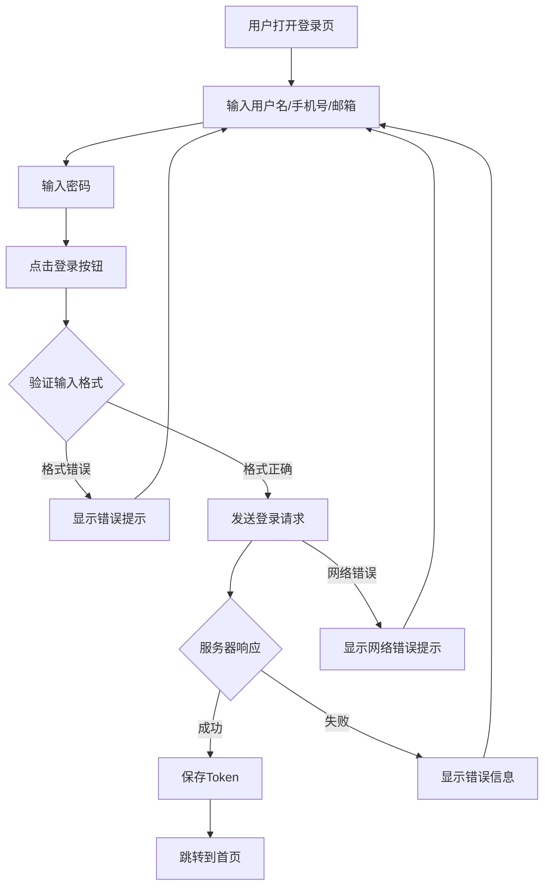

# 功能点需求描述文档 - 登录页功能

## 1. 功能基本信息

### 1.1 功能名称
用户登录功能

### 1.2 功能编号
F-001

### 1.3 所属模块
用户认证模块

### 1.4 创建日期
2024-01-15

### 1.5 最后更新日期
2024-01-15

### 1.6 需求提出人
产品经理

### 1.7 负责人
- **产品负责人**: 张产品
- **开发负责人**: 李开发
- **测试负责人**: 王测试

### 1.8 优先级
P0-紧急

### 1.9 预计工作量
5人天

---

## 2. 功能概述

### 2.1 功能描述
提供用户通过用户名/手机号/邮箱和密码进行身份验证，成功登录后访问系统核心功能的入口页面。

### 2.2 业务背景
系统需要用户身份认证机制来确保数据安全和用户隐私，登录功能是用户访问系统的基础，所有后续功能都依赖于用户成功登录后获取的权限和身份信息。

### 2.3 目标用户
- **主要用户**: 注册用户（所有已注册的用户）
- **次要用户**: 管理员用户

### 2.4 业务价值
- 保护用户数据安全，防止未授权访问
- 为用户提供个性化服务的基础
- 记录用户行为，便于数据分析和运营

---

## 3. 用户故事

### 3.1 用户故事描述
**作为** 已注册用户  
**我希望** 通过账号密码登录系统  
**以便** 访问系统的个人功能和数据

### 3.2 用户场景

#### 场景1: 正常登录成功
- **前置条件**: 用户已注册账号，账号状态正常
- **操作步骤**:
  1. 用户访问系统首页或登录页面
  2. 输入用户名
  3. 输入正确的密码
  4. 点击"登录"按钮
  5. 系统验证身份信息
- **预期结果**: 登录成功，跳转到系统首页或之前访问的页面，显示用户信息

#### 场景2: 密码错误
- **前置条件**: 用户已注册账号
- **操作步骤**:
  1. 用户输入正确的用户名
  2. 输入错误的密码
  3. 点击"登录"按钮
- **预期结果**: 提示"用户名或密码错误"，登录失败，密码输入框清空，登录按钮可再次点击

#### 场景3: 账号不存在
- **前置条件**: 无
- **操作步骤**:
  1. 用户输入不存在的用户名
  2. 输入任意密码
  3. 点击"登录"按钮
- **预期结果**: 提示"用户名或密码错误"（不暴露账号是否存在），登录失败


---

## 4. 功能详细说明

### 4.1 功能特性列表
- [x] 仅支持用户名/密码登录（不支持手机号/邮箱登录）
- [x] 密码加密传输和存储
- [x] 验证码防暴力破解
- [x] 登录失败次数限制
- [x] 登录状态保持

### 4.2 核心功能点

#### 4.2.1 超级管理员
- 超级管理员账号：mpadmin 
- 超级管理员登录密码：admin123

#### 4.2.2 用户名识别
**描述**: 校验用户输入的用户名是否合法  
**触发条件**: 用户输入用户名并失去焦点 / 点击登录  
**处理逻辑**: 
- 用户名为必填
- 长度限制：1-50字符
- 支持字符：字母、数字、下划线（`[a-zA-Z0-9_]`）
**输出结果**: 校验通过/失败（失败时给出错误提示）

#### 4.2.3 密码验证
**描述**: 验证用户输入的密码是否正确  
**触发条件**: 用户输入密码并点击登录  
**处理逻辑**: 
- 对用户输入的密码进行加密（MD5/SHA256）
- 与数据库存储的加密密码进行比对
- 记录登录尝试次数
**输出结果**: 返回验证结果（成功/失败）

#### 4.2.4 登录状态管理
**描述**: 生成并管理用户登录状态  
**触发条件**: 密码验证成功后  
**处理逻辑**: 
- 生成JWT Token或Session ID
- 记录用户登录时间和IP地址
- 设置Token过期时间（默认24小时）
- 返回Token给前端存储
**输出结果**: 返回Token，前端存储到LocalStorage或Cookie


### 4.3 边界条件
- **正常情况**: 用户输入正确账号密码，成功登录
- **异常情况**: 
  - 账号不存在：提示"用户名或密码错误"（统一提示，不暴露账号是否存在）
  - 密码错误：提示"用户名或密码错误"，失败次数+1
  - 连续失败5次：锁定账号30分钟，需要验证码
  - 账号被锁定：提示"账号已被锁定，请30分钟后再试"
  - 账号被禁用：提示"账号已被禁用，请联系管理员"
  - 网络异常：提示"网络连接失败，请检查网络后重试"
  - 服务异常：提示"服务暂时不可用，请稍后重试"
- **边界情况**: 
  - 输入框为空：禁用登录按钮
  - 输入长度超限：限制用户名50字符，密码128字符
  - 特殊字符输入：前端转义，后端校验

### 4.4 业务规则
1. 用户名和密码均为必填项
2. 密码长度至少8位，至少包含字母和数字
3. 连续登录失败3次显示验证码
4. 连续登录失败5次，账号锁定30分钟
5. Token有效期：24小时
6. 登录成功后，返回之前访问的页面，如无则跳转首页
7. 已登录用户访问登录页，自动跳转到首页

---

## 5. 业务流程

### 5.1 主流程


```
流程步骤：
1. 用户访问登录页面
2. 输入用户名
3. 输入密码
5. 点击"登录"按钮
6. 前端校验输入格式
9. 发送登录请求到后端
11. 查询用户信息
12. 验证密码（加密比对）
13. 检查账号状态（正常/锁定/禁用）
14. 生成Token
15. 记录登录日志（时间、IP）
16. 返回Token和用户信息
17. 前端存储Token
18. 跳转到目标页面（首页或之前访问的页面）
```

### 5.2 异常流程

**流程1：密码错误**
```
1. 用户输入错误密码
2. 点击登录
3. 后端验证失败
6. 前端显示错误提示
7. 清空密码输入框
```

```

**流程3：网络异常**
```
1. 用户点击登录
2. 请求发送失败（超时/网络错误）
3. 前端捕获异常
4. 显示网络错误提示
5. 保持登录表单状态，允许重试
```

### 5.3 流程图



---

## 6. 界面设计需求

### 6.1 页面/界面列表
- **登录页面**: 用户登录入口页面
  - 说明: 提供用户名/密码输入和登录功能的页面

### 6.2 界面元素

#### 6.2.1 登录表单容器
- **类型**: 表单容器
- **位置**: 页面中央
- **功能**: 包含所有登录相关输入元素
- **交互**: 无直接交互
- **状态**: 始终显示

#### 6.2.2 账号输入框
- **类型**: 文本输入框（input text）
- **位置**: 表单顶部
- **功能**: 接收用户输入的用户名/手机号/邮箱
- **交互**: 
  - 支持输入、删除、粘贴
  - 获得焦点时显示边框高亮
  - 失去焦点时校验格式
- **状态**: 
  - 正常：可输入
  - 错误：显示红色边框和错误提示
  - 禁用：账号锁定期间禁用

#### 6.2.3 密码输入框
- **类型**: 密码输入框（input password）
- **位置**: 账号输入框下方
- **功能**: 接收用户输入的密码
- **交互**: 
  - 默认隐藏密码（显示为●）
  - 点击眼睛图标可显示/隐藏密码
  - 支持输入、删除、粘贴
- **状态**: 
  - 正常：可输入
  - 错误：显示红色边框和错误提示

#### 6.2.4 验证码输入框
- **类型**: 文本输入框 + 验证码图片
- **位置**: 密码输入框下方（需要时显示）
- **功能**: 输入图形验证码
- **交互**: 
  - 点击验证码图片可刷新
  - 输入验证码
- **状态**: 
  - 隐藏：正常登录时不显示
  - 显示：连续失败3次后显示
  - 错误：显示错误提示

#### 6.2.6 登录按钮
- **类型**: 主按钮（primary button）
- **位置**: 表单底部
- **功能**: 提交登录请求
- **交互**: 
  - 点击触发登录
  - 登录中显示加载状态（禁用按钮，显示loading动画）
- **状态**: 
  - 正常：可点击（账号密码已填写）
  - 禁用：账号密码未填写或为空
  - 加载中：登录请求进行中（显示loading）

#### 6.2.8 错误提示信息
- **类型**: 提示文本
- **位置**: 表单顶部或对应输入框下方
- **功能**: 显示登录错误信息
- **交互**: 自动显示，3秒后自动消失或手动关闭
- **状态**: 显示/隐藏

#### 6.2.9 注册链接
- **类型**: 链接（link）
- **位置**: 页面底部或登录表单下方
- **功能**: 跳转到注册页面
- **交互**: 点击跳转到 `/register`
- **状态**: 正常/悬停

### 6.3 交互设计
- **输入框聚焦**: 获得焦点时边框变蓝色，失去焦点时校验格式
- **实时校验**: 失去焦点时立即校验格式，错误时显示红色边框和提示
- **登录按钮状态**: 账号和密码都填写时按钮可用，否则禁用（灰色）
- **加载状态**: 点击登录后，按钮显示loading动画，禁用所有输入框
- **错误提示**: 登录失败时，在表单顶部显示错误提示（红色背景），3秒后自动消失
- **回车提交**: 在密码输入框中按Enter键，等同于点击登录按钮
- **验证码刷新**: 点击验证码图片可刷新，有loading动画

### 6.4 响应式要求
- **桌面端**: 
  - 登录表单宽度：400px
  - 居中显示
  - 支持键盘操作（Tab切换，Enter提交）
- **平板端**: 
  - 登录表单宽度：350px
  - 居中显示
  - 适配触摸操作
- **移动端**: 
  - 登录表单宽度：90%（左右边距5%）
  - 垂直居中
  - 输入框高度加大，便于触摸
  - 隐藏非必要元素（如注册链接可在菜单中）

### 6.5 设计参考
- [设计稿链接：Figma/蓝湖等设计工具链接]
- 设计风格：简洁现代，符合品牌VI规范
- 配色方案：主色调#1890ff，错误提示#ff4d4f，成功提示#52c41a
- [参考设计图：] 
---

## 7. 数据需求

### 7.1 输入数据
| 字段名称 | 类型 | 必填 | 格式要求 | 说明 |
|---------|------|------|---------|------|
| account | String | 是 | 用户名：1-50字符，支持字母数字下划线 | 用户输入的登录用户名 |
| password | String | 是 | 8-128字符，至少包含字母和数字 | 用户输入的登录密码 |
| captcha | String | 否 | 4-6位字母数字 | 验证码（连续失败3次后必填） |


---

## 8. API 接口需求
#### 8.1.1 用户登录接口
- **接口描述**: 用户通过账号和密码登录系统
- **请求方法**: POST
- **请求路径**: `/api/auth/login`
- **请求头**:
  ```json
  {
    "Content-Type": "application/json"
  }
  ```
- **请求参数**:
  ```json
  {
    "account": "string, 必填, 用户名",
    "password": "string, 必填, 密码（前端MD5加密后传输）",
    "captcha": "string, 可选, 验证码（需要时必填）",
    "captchaId": "string, 可选, 验证码ID（需要时必填）"
  }
  ```
- **请求示例**:
  ```json
  {
    "account": "user123",
    "password": "e10adc3949ba59abbe56e057f20f883e",
    "captcha": "A3B2",
    "captchaId": "captcha_123456"
  }
  ```
- **成功响应** (200):
  ```json
  {
    "code": 200,
    "message": "登录成功",
    "data": {
      "token": "eyJhbGciOiJIUzI1NiIsInR5cCI6IkpXVCJ9...",
      "refreshToken": "refresh_token_xxx",
      "userId": "123456",
      "username": "user123",
      "avatar": "https://example.com/avatar.jpg",
      "expiresIn": 604800
    }
  }
  ```
- **错误响应** (400):
  ```json
  {
    "code": 400,
    "message": "用户名或密码错误",
    "data": null
  }
  ```
- **错误响应** (429) - 账号锁定:
  ```json
  {
    "code": 429,
    "message": "账号已被锁定，请30分钟后再试",
    "data": {
      "lockedUntil": "2024-01-15 14:30:00"
    }
  }
  ```
- **错误码说明**:
  - 200: 登录成功
  - 400: 参数错误或账号密码错误
  - 401: Token无效或过期
  - 403: 账号被禁用
  - 429: 账号被锁定
  - 500: 服务器内部错误

#### 8.1.2 获取验证码接口
- **接口描述**: 获取图形验证码（登录失败3次后需要）
- **请求方法**: GET
- **请求路径**: `/api/auth/captcha`
- **请求参数**: 无
- **成功响应** (200):
  ```json
  {
    "code": 200,
    "message": "成功",
    "data": {
      "captchaId": "captcha_123456",
      "captchaImage": "data:image/png;base64,iVBORw0KGgoAAAANSUhEUgAA..."
    }
  }
  ```

### 8.2 接口依赖
- **依赖接口**: 无
- **依赖说明**: 登录接口是独立的认证接口，不依赖其他业务接口

---

## 9. 性能要求

### 9.1 响应时间
- **页面加载时间**: < 1秒（首次加载，不含图片）
- **接口响应时间**: < 500ms（95%的请求）
- **登录操作响应时间**: < 1秒（从点击登录到跳转）
- **验证码加载时间**: < 300ms

### 9.2 并发要求
- **支持并发用户数**: 1000+ 用户同时登录
- **QPS要求**: 登录接口支持 500 QPS
- **数据库查询**: 登录查询响应时间 < 100ms

---

## 10. 安全要求

### 10.1 权限控制
- **访问权限**: 所有用户（包括未登录用户）可以访问登录页面
- **操作权限**: 只有输入正确账号密码的用户才能登录成功

### 10.2 数据安全
- **密码传输**: 前端使用MD5/SHA256加密后传输，HTTPS协议传输
- **密码存储**: 后端使用BCrypt加密存储，盐值随机生成
- **敏感数据处理**: 
  - 密码不记录日志
  - 错误日志不包含完整密码信息
  - 密码输入框使用password类型，防止浏览器自动填充（可选）

### 10.3 安全校验
- **输入校验**: 
  - 防止SQL注入：使用参数化查询
  - 防止XSS攻击：输入内容转义
  - 防止CSRF攻击：Token验证
- **暴力破解防护**: 
  - 连续失败3次显示验证码
  - 连续失败5次锁定账号30分钟
  - 记录登录IP，异常IP限制登录
- **Token安全**: 
  - Token设置合理的过期时间
  - 支持Token刷新机制
  - Token存储在HttpOnly Cookie或LocalStorage（根据安全级别选择）

---

## 11. 兼容性要求

### 11.1 浏览器兼容
- Chrome 90+ ✅
- Firefox 88+ ✅
- Safari 14+ ✅
- Edge 90+ ✅
- IE 11（如需要）⚠️ 基础支持

### 11.2 设备兼容
- **桌面端**: Windows 10+, macOS 10.15+, Linux主流发行版
- **移动端**: iOS 13+, Android 8+
- **平板端**: iPadOS 13+, Android 8+

---

## 12. 验收标准

### 12.1 功能验收
- [x] 仅支持用户名/密码登录（不支持手机号/邮箱登录）
- [x] 输入正确的账号密码可以成功登录
- [x] 输入错误的账号密码显示错误提示
- [x] 连续失败3次显示验证码
- [x] 连续失败5次锁定账号30分钟
- [x] 登录成功后正确跳转（首页或之前访问的页面）
- [x] 已登录用户访问登录页自动跳转首页
- [x] 回车键可以提交登录表单
- [x] 输入框格式校验正确
- [x] 错误提示信息准确清晰

### 12.2 性能验收
- [x] 页面加载时间 < 1秒
- [x] 接口响应时间 < 500ms（95%请求）
- [x] 支持1000+并发用户登录

### 12.3 兼容性验收
- [x] 主流浏览器正常显示和使用
- [x] 不同设备正常显示和使用
- [x] 响应式布局在各尺寸屏幕上正常显示

### 12.4 安全验收
- [x] 密码加密传输和存储
- [x] 防止SQL注入和XSS攻击
- [x] 暴力破解防护机制正常工作
- [x] Token安全存储和验证
- [x] 登录日志正确记录

---

## 13. 依赖关系

### 13.1 前置依赖
- **依赖功能**: 用户注册功能（用户需先注册才能登录）
- **依赖说明**: 登录功能依赖用户注册功能，需要先有用户数据才能进行登录验证

### 13.2 后续影响
- **影响功能**: 
  - 所有需要登录的功能模块（个人中心、数据管理、权限控制等）
  - Token验证中间件
  - 用户会话管理
- **影响说明**: 登录功能是所有需要认证的功能的基础，登录成功后获取的Token用于后续所有需要认证的接口请求

### 13.3 技术依赖
- **技术组件**: 
  - JWT Token生成库（如：jsonwebtoken）
  - 密码加密库（如：bcrypt）
  - 验证码生成库（如：svg-captcha）
  - 前端加密库（如：crypto-js）
- **第三方服务**: 无（如需要短信验证码，则依赖短信服务）

---

## 14. 风险与限制

### 14.1 潜在风险
| 风险 | 影响程度 | 可能性 | 应对措施 |
|------|---------|--------|---------|
| 密码泄露风险 | 高 | 中 | 使用HTTPS传输，密码加密存储，定期安全审计 |
| 暴力破解攻击 | 高 | 高 | 实施验证码机制，账号锁定机制，IP限制 |
| Token泄露风险 | 中 | 中 | Token设置合理过期时间，使用HttpOnly Cookie存储，定期刷新 |
| 单点故障 | 中 | 低 | 登录服务集群部署，负载均衡，服务降级方案 |
| 用户体验差 | 低 | 中 | 优化加载速度，友好的错误提示，清晰的表单校验与反馈 |

### 14.2 已知限制
- **账号锁定时间**: 固定30分钟，无法自定义
- **Token刷新**: 目前不支持自动刷新，需要重新登录或使用refreshToken
- **设备限制**: 最多同时在线3个设备，超出后最早登录的设备会被踢出（如需要）
- **验证码类型**: 目前仅支持图形验证码，不支持短信验证码（如需要可后续扩展）

---

## 15. 变更记录

| 版本 | 日期 | 修改人 | 修改内容 |
|------|------|--------|---------|
| v1.1.19 | 2026-01-19 | 陈建辉 | 原始需求搬到Cursor |


---

## 16. 备注

1. **密码策略**: 当前密码策略为至少8位包含字母和数字，后续可根据安全需求调整
2. **验证码**: 验证码功能可根据实际安全需求调整触发条件（如：从3次改为5次）
3. **Token存储**: Token存储方式（Cookie vs LocalStorage）可根据安全需求选择，目前建议使用HttpOnly Cookie提高安全性
4. **国际化**: 当前文档为中文版本，如需支持多语言，需要补充国际化相关需求
5. **社交登录**: 当前仅支持账号密码登录，后续可扩展微信、QQ、GitHub等社交登录方式

---


**文档结束**
